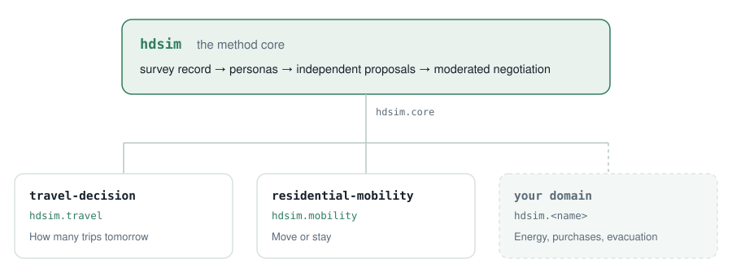

<div align="center">

# 🏘️ HDSim

**An open-source multi-agent ecosystem for household decision-making simulation, built on the PEMAND method.**

<p>
<a href="https://github.com/HDSim-AI/hdsim"></a>
<a href="https://github.com/HDSim-AI/hdsim/actions/workflows/ci.yml"></a>
<a href="https://github.com/HDSim-AI/hdsim/blob/main/pyproject.toml"></a>
<a href="https://github.com/HDSim-AI/hdsim/blob/main/LICENSE"></a>
<a href="https://arxiv.org/abs/2604.10475"></a>
<a href="https://yushundong.github.io/pemand_simulation/pemand_official_site.html"></a>
</p>

<a href="https://yushundong.github.io/pemand_simulation/pemand_official_site.html"></a>

### [▶  Try the live demo](https://yushundong.github.io/pemand_simulation/pemand_official_site.html)

Six household scenarios replay in your browser. Nothing to install, no API key.

<sub><a href="https://github.com/HDSim-AI/.github/releases/download/media-2026-08/hdsim_launch.mp4">Watch the 74-second launch film</a></sub>

</div>

## What HDSim does

Household decisions like trip planning, relocation and evacuation are negotiated between the
people in the household. They are not computed by one equation. HDSim simulates that negotiation
and returns a decision for each household, with the conversation that produced it.

<p align="center">
<picture>
  <source media="(prefers-color-scheme: dark)" srcset="./pipeline-core-dark.svg">
  
</picture>
</p>

The method is PEMAND, persona-enriched multi-agent negotiation. Across national and regional
household surveys in both domains it outperforms classical ML and LLM baselines; the
[paper](https://arxiv.org/abs/2604.10475) has the numbers.

| You are trying to… | What you get |
|---|---|
| Forecast trip generation under a new price, fare, or transit line | A trip count for each household, from its own record |
| Plan for evacuation or post-disaster relocation | Move or stay, household by household |
| Test a policy you cannot field a new survey for | Predictions for the households you already have, with no new fieldwork |

| You want to… | Go to |
|---|---|
| See it run, with nothing installed | [Live demo](https://yushundong.github.io/pemand_simulation/pemand_official_site.html) |
| Watch a household negotiate in your terminal | [Quick start](#how-the-repositories-fit-together) |
| Predict household trips | [travel-decision](https://github.com/HDSim-AI/travel-decision) |
| Predict whether a household moves | [residential-mobility](https://github.com/HDSim-AI/residential-mobility) |
| Add a decision we have not built yet | [Contributing](https://github.com/HDSim-AI/hdsim/blob/main/CONTRIBUTING.md) |
| Read the method | [arXiv:2604.10475](https://arxiv.org/abs/2604.10475) |

## How the repositories fit together

**One core, and a package per decision.** `hdsim` holds the method. Each domain package adds only
the survey loader and the configuration for one decision, so the pipeline itself never changes.

<p align="center">
<picture>
  <source media="(prefers-color-scheme: dark)" srcset="./architecture-dark.svg">
  
</picture>
</p>

| The core | |
|---|---|
| [`hdsim`](https://github.com/HDSim-AI/hdsim) | Persona construction, independent proposals, moderated negotiation. Every domain uses it unchanged. |

| Domain packages | Decides |
|---|---|
| [`travel-decision`](https://github.com/HDSim-AI/travel-decision) | How many trips a household makes tomorrow |
| [`residential-mobility`](https://github.com/HDSim-AI/residential-mobility) | Whether a household moves |

Start with `hdsim`. A recorded household negotiation replays in the terminal with no API key and no
data download:

```bash
git clone https://github.com/HDSim-AI/hdsim && cd hdsim
pip install -e .
hdsim demo
```

## Contributing

A new decision domain is one file. Copy
[`minimal_domain.py`](https://github.com/HDSim-AI/hdsim/blob/main/examples/minimal_domain.py),
change six marked places, and run it with no API key. Energy use, major purchases, family planning
and evacuation are all open; so are survey loaders, scenarios and evaluations for the two domains
that exist. The [contributing guide](https://github.com/HDSim-AI/hdsim/blob/main/CONTRIBUTING.md)
starts by asking which of those you want.

If something is unclear, or you think a design choice is wrong, or you want to talk through a use case before writing code, send an email to mustafasameen@ufl.edu. We would rather have the conversation than have you guess.

## Citation

```bibtex
@article{sun2026pemand,
  title   = {PEMAND: Persona-Enriched Multi-Agent Negotiation for Household Decision-Making},
  author  = {Sun, Yuran and Sameen, Mustafa and Zhang, Yaotian and Gu, Rongguan and
             Vibhute, Mrunal and Wu, Chia-yu and Lei, Yuanyuan and Zhao, Xilei},
  journal = {arXiv preprint arXiv:2604.10475},
  year    = {2026}
}
```

<sub>MIT licensed. Try the <a href="https://yushundong.github.io/pemand_simulation/pemand_official_site.html">live demo</a>: six replayable household scenarios, no setup required.</sub>
